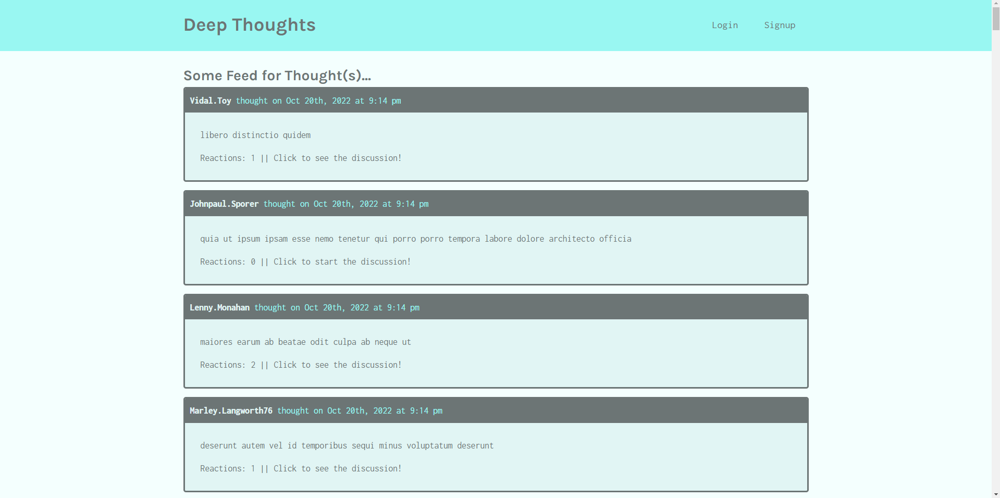

Deep Thoughts
  

  
  ## Description 
  This project is a full stack web application using the MERN Stack along with GraphQL and Apollo. This is a blogging platform that will allow users to sign up and login, view profile pages, add friends, add reactions, and add thoughts. This application uses JWT for authentication and is deployed on Heroku.

  ## Table of Contents
  * [Installation](#installation)
  * [Usage](#usage)
  * [License](#license)
  * [Contributing](#contributing)
  * [Tests](#tests)
  * [Questions](#questions)
  
  ## Installation 
  The user should clone the repository from GitHub and install dependencies. For development or testing purposes, run `npm install` on both client and server directories to install dependencies. There are two servers for client side and server side, which can be run on their own. To run both servers at the same time, open the root directory and run `npm run develop`.

  ## Usage 
  This application will allow users to login/signup and create thoughts, users can then add reactions to the thoughts, as well as add other users to their friends list.
  The deployed application can be viewed on [Heroku](https://morning-shore-73697.herokuapp.com/)
  

  ## License 
  This project is license under MIT

  ## Contributing 
  Feel free to reach out via email.

  ## Tests
  N/A

  ## Questions
  If you have any questions about this projects, please contact me directly at tyler.rodgers74@gmail.com. You can view more of my projects at https://github.com/TSRodgers.
